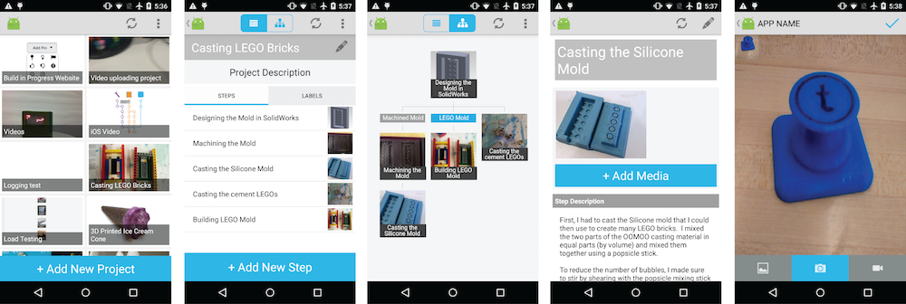

# Build-in-Progress-Android
This repo is the open source version of the Build in Progress Android app, to be used alongside an instance of the [Build in Progress Web Application](https://github.com/ttseng/Build-in-Progress-Web).

Features included in the Build in Progress iOS application include:

* Camera and Video interface for capturing and uploading multiple media files at once
* Drag and drop interface for creating branches in BiP projects
* Project and step editing

To use, edit the `src/main/java/com/example/helperClass/Constants.java` file with the URL for your web application (`SITE_URL`) and your AWS image bucket URL (`AWS_IMAGE_URL`) and import the project into Android Studio.
